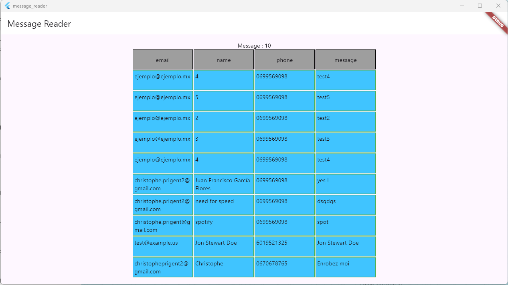
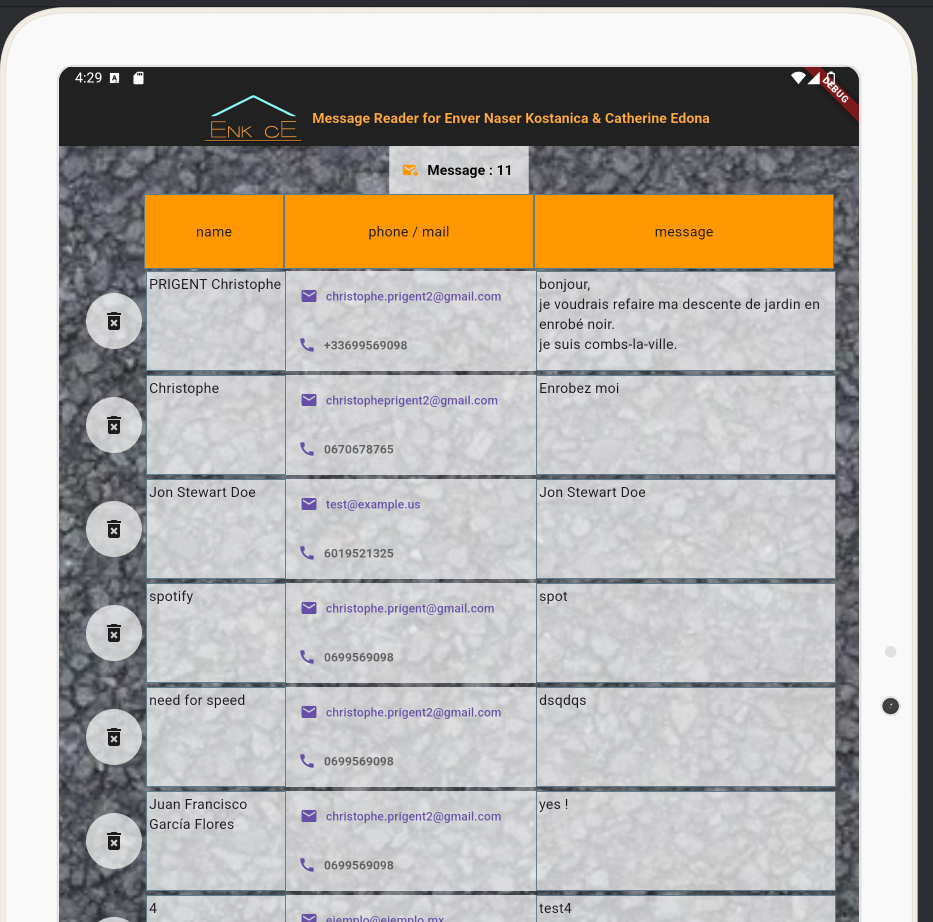

# message_reader

A new simple Flutter project that display externals messages :

app release with no customization :

android release with customization :

## setup
you must provide an endpoint and config your dot env file.
([more detail here](./message_reader/README.md))

## current limitations

- field name are hardcoded : 
_"email", "name", "phone", "message"_.
- endpoint must be https and basicAuth protected.
- look and feel gather in [one file](./message_reader/lib/widgets/customs.dart) but also hardcoded.

