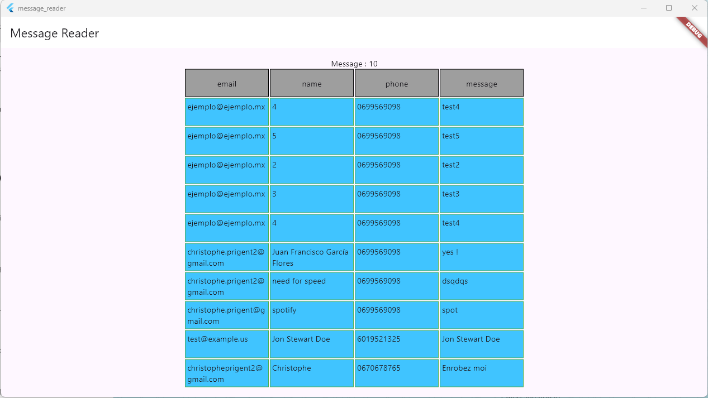

# message_reader

A new simple Flutter project that display externals messages :



## Getting Started

### endpoint
we need an https endpoint to get messages, expected return :
```json
[{ "date" :"2025-01-16 21:12",
  "name" :"senderName", 
  "tel" :"sender phone number",
  "message" :"sender message",
  "email" :"sender@mail.mx",
  "debug" :"any extra data" },
  {/*...*/}]
```
### dot env
copy ([dotenv.sample](./dotenv.sample)) to `.env`

then edit your `.env` file following instructions in sample.

`.env` is gitignore.
